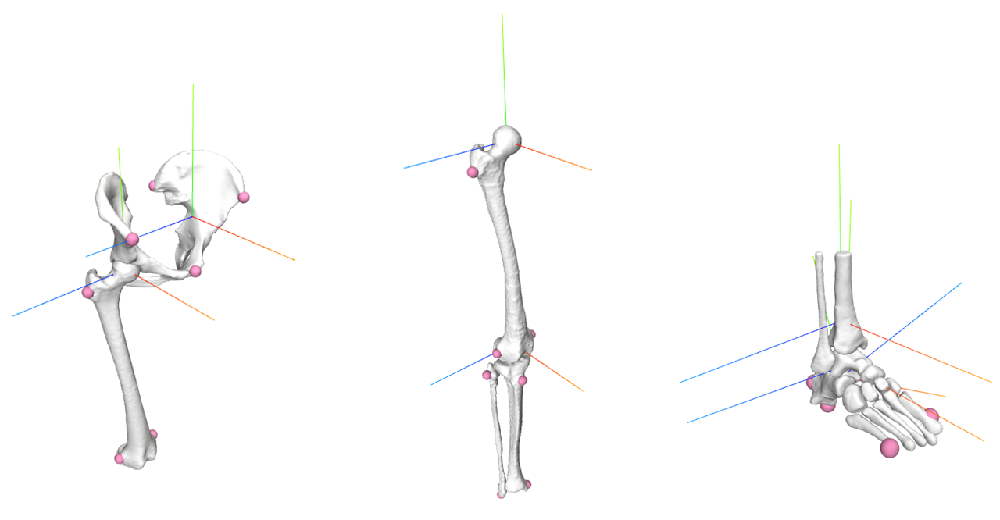

# STAPLE: Shared Tools for Automatic Personalised Lower Extremity models

## Overview
This repository contains a computational tool called STAPLE that we created for 
enabling researchers in the biomechanical field to build models of the lower extremity 
with minimum effort, ideally just clicking `RUN` on a script.

STAPLE requires three-dimensional bone geometries as an input, which are normally segmented from medical images.
It can create models of entire legs or few joints, depending on the available data or research intent. 

Currently the tool creates kinematic and kinetic skeletal models but will soon be extended with complete musculoskeletal capabilities.

## Summary of available methods on STAPLE

STAPLE collects some algorithms from the literature and others that we developed on purpose.
The following table includes the methods currently available in STAPLE.

| Bone                 | Rigid Body Name | Joint Coordinate System | Algorithms       |
| ---                  | ---             | ---                     | ---              |
| Pelvis               | pelvis          | ground-pelvis           | STAPLE-Pelvis    |
|                      |                 |                         | Kai-Pelvis       |
| Femur                | femur           | hip child               | Kai-Femur        |
|                      |                 |                         | GIBOC-Femur      |
|					   |                 | knee parent             | Kai-Femur        |
|					   |                 |                         | GIBOC-Spheres    |
|					   |                 |                         | GIBOC-Ellipsoids |
|					   |                 |                         | GIBOC-Cylinder   |
| Tibia+Fibula         | tibia           | knee child              | Kai-Tibia        |
|                      |                 |                         | GIBOC-Ellipse    |
|                      |                 |                         | GIBOC-Plateau    |
|                      |                 | ankle parent            | uses child JCS   |
| Patella              | patella         | TBA                     | TBA |
| Talus                | talus           | ankle child             | STAPLE-Talus     |
|                      |                 | subtalar parent         | STAPLE-Talus     |
| Foot bones           | calcn           | subtalar child          | uses parent JCS  |
|                      |                 | foot (auxiliary)        | STAPLE-Foot      |
| Foot Phalanges       | toes            | TBA                     | TBA |

## Requirements
* MATLAB v2018b or more recent
* OpenSim v4.0 or higher, downloadable from this [website](https://simtk.org/projects/opensim)

## Preliminary settings
* OpenSim (v4.0 or higher) Application Programming Interface (API) for MATLAB must be installed and working. Please refer to the [OpenSim documentation](https://simtk-confluence.stanford.edu/display/OpenSim/Scripting+with+Matlab) for instructions about installation.
* Add the `STAPLE` folder, normally locate in `msk-STAPLE\STAPLE` to your MATLAB path.

# Models you can generate using STAPLE
* **Monolateral complete models**: they include pelvis, femur, tibia and fibula, talus, calcaneus and foot bones (excluded phalanges)
* **Partial models**: they are a subset of a complete model and include any meaningful combination of the previous bones. 
For example models of hip, knee and ankle joints can be created as individual models.

# How to use STAPLE
The workflow consists in:
1. segmenting bone geometries from medical images, tipically computed tomography (CT) or magnetic resonance imaging (MRI) scans. 
This step is not done in STAPLE but using third-party segmentation software, of which you can find a list at [this link](https://github.com/modenaxe/awesome-biomechanics#segmentation-of-medical-images-art-wip).
The bone geometries are normally exported as surface models in [STL format](https://en.wikipedia.org/wiki/STL_(file_format)).
2. Cleaning and improving the quality of the obtained surface models, normally running filters for improving the topology. Also in this case, there are several options to process the geometries (a list of software is available at at [this link](https://github.com/modenaxe/awesome-biomechanics#manipulation-processing-and-comparison-of-surface-meshes)).
Individual bones are also grouped at this stage, for example the surface meshes of tibia and fibula can be joined using the `flatten mesh layers` filter in [MeshLab](https://www.meshlab.net/).
3. Bone geometries are renamed according to the typical names of the OpenSim models and saved in a folder with an appropriate name. The last step is especially important for batch processing, please see folder setup in the provided examples.
4. Check the provided example more similar to what you want to do, as it will most likely provide a good idea of the setup steps.

## Examples of use

Examples of possible modelling scenarios are provided in the main STAPLE folder. 
You can run the example the examples and adapt them to your own study or data.
More examples will be added in time.

## Bone geometries for testing and examples
Test geometries are available in the "test_geometries" directory:
* LHDL (CT)
* TLEM2 (MRI)
* TLEM2 (CT)
* JIA (MRI)
* ICL (MRI)
* VAKHUM (CT)
* ULB_VM (CT)
* JIA_ANKLE (MRI)

# Further Development
* Segment mass properties and degrees of freedom of the joint models can easily be customised. 
* The sagittal profile of femoral condyles is available and could be used to personalized knee joint models like Yamaguchi's knee in combination with the automated slope estimation presented by Amirtharaj et al. (2018).
